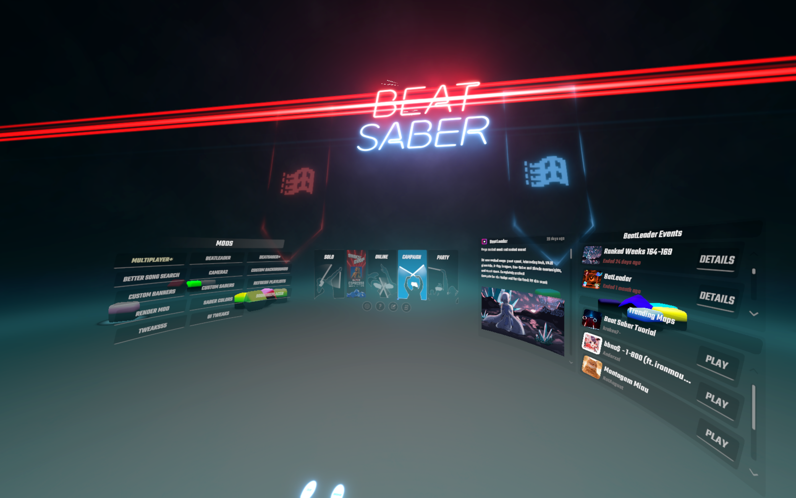
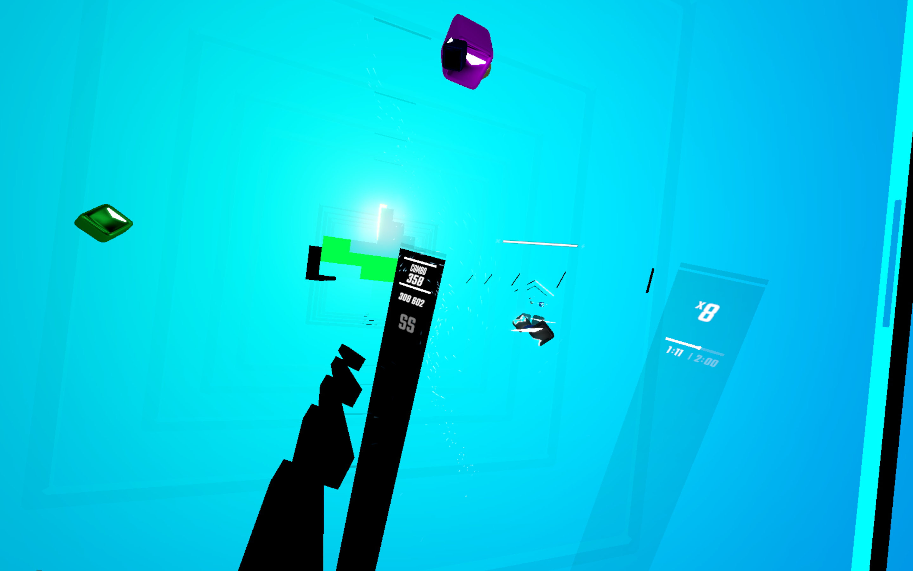

# RealTimeClanker [Prototype]
A Beat Saber mod that randomizes various objects every time a scene transition happens. This mod has some stability issues since nothing is blacklisted from being randomized. I made this mod after Beat Saber pretty much broke with RTCV's FileStub after 1.34.5.

Expect flashing lights, clown vomit, black screens (soft crashes), or game crashes.

## Requirements
Right now the mod requires these dependencies and may change in the near future
- BSIPA: ^4.2.0
- BS Utils: ^1.12.0 (May work with older versions but unsure)

## Demo

